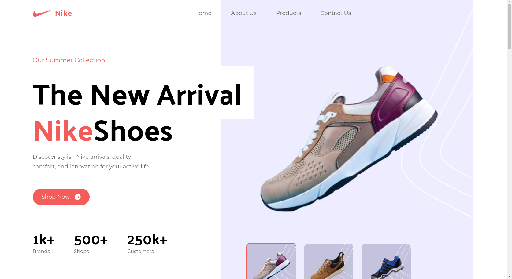

# React + Vite
# Nike Site

<h1 align="center">Hi 👋, I'm Ahmed M Saber</h1>
<h3 align="center">FullStack developer from Egypt</h3>

<h3 align="left">Project Preview </h3>
<a href="https://nike-amber-sigma.vercel.app"target="blank" class="background: blue"> Click Here </a>

<h3 align="left"> Tools used In Project:</h3>

    

<h3 align="left">Connect with me:</h3>

 Just git clone it and type npm run dev 

